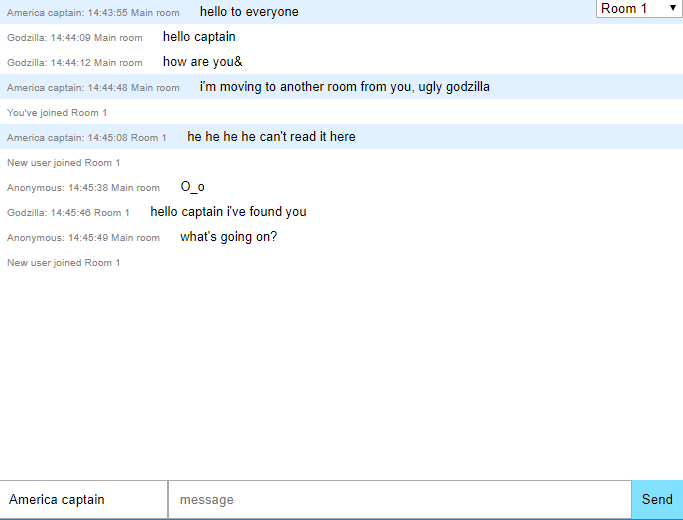
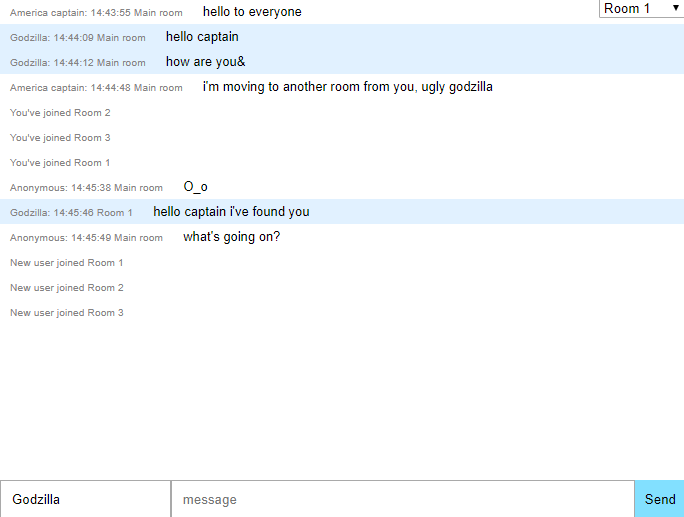

# Simple chat

#### Functionality

The idea was to build chat with basic functionality:

1. User is able to select `username` and print messages via `Enter` keydown or `Send` button;
1. User's personal messages are styled with blue color. User's `id` is tied to tab so if you open several tabs with chat all the users will be different;
1. User is able to act `/me` action. To do this the user need to print message which starts with `/me` text and the message will be shown in small text. If user, let's name it Godzilla, print `/me hello New York` we will see `Godzilla hello New York`;
1. If user get message being unfocused to the chat, there will play sound of the new message. At the same time `icon` and `title` of the chat tab will be replaced to the "unread" view.
1. There is simple rooms functionality. Chat has one general room the messages of which will be shown at all rooms. But also we have 3 private rooms that can used for private chatting. If someone enters or leaves room you get message about it.
1. There is an ability to show `10` last messages when your enter's chat. (It will more efficient to make it with database, but here these last messages are stored in memory)

#### Libraries

There vere used several basic libraries such as `socket.io` and `express` for backend. Frontend part was build without any frameworks or libraries except `socket.io-client` for server interactions. The project was configured via `webpack` and ready to production deploy. It was done with help of `heroku` and the result you can find here https://zenby-simple-chat.herokuapp.com/ (don't worry if it doesn't loads at one second, be patient until `heroku` start server)

#### Screenshots

